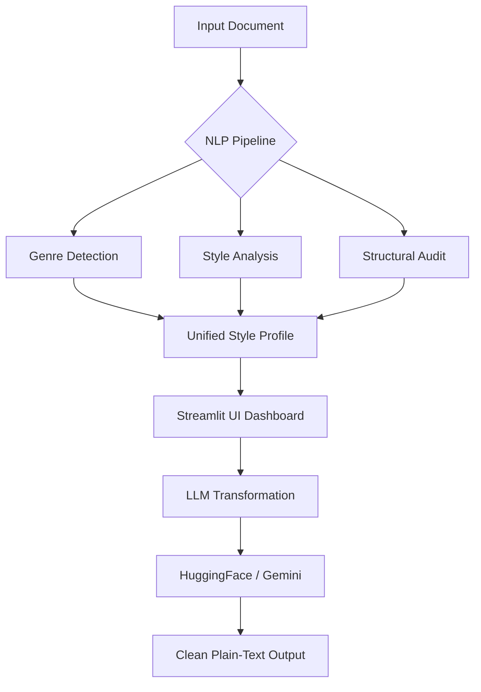

# Style Detection & Rewriting Engine 🪄

A professional-grade NLP intelligence platform designed to analyze, detect, and transform document styles with a specific focus on **SOPs (Standard Operating Procedures)**, **Compliance**, and **Technical Documentation**.

---

## 🚀 Key Features

- **Semantic Domain Discovery**: Automatically identifies if a document is an IT/OT Security SOP, QMS Procedure, Legal Draft, or Technical Manual using SBERT embeddings.
- **Deep Style Profiling**: Analyzes tone (formality, objectivity), voice (active/passive), readability scores, and vocabulary diversity.
- **Procedural Auditing**: Extracts compliance IDs (DEV, CAPA, SOP), maps workflow actors/actions, and identifies structural gaps in procedures.
- **AI-Powered Transformation**: Rewrite, improve, or generate new content using **HuggingFace (Primary)** or **Gemini 2.0 Flash (Fallback)** while maintaining strict compliance integrity.
- **Docker-Ready & CI/CD Integrated**: Full containerization support with automated deployment pipelines via GitHub Actions.

---

## 🛠️ Tech Stack

- **Frontend**: Streamlit (Modern UI with Custom CSS)
- **NLP Core**: SpaCy, Scikit-Learn, SBERT (Sentence-Transformers)
- **Linguistics**: Textstat (Readability), Langdetect, Pronouncing
- **LLM Engine**: HuggingFace Inference API & Google Gemini API
- **Infrastructure**: Docker, Docker Compose, GitHub Actions

---

## 📈 Process Flow



---

## 💼 Use Cases

### 1. Compliance Integrity Verification
Audit newly drafted SOPs against historical styles to ensure they meet the rigorous linguistic requirements of standards like **IEC 62443** or **ISO 27001**.

### 2. Style Normalization
Take technical notes from engineers and automatically transform them into formal, active-voice SOP sections while preserving critical technical IDs and constraints.

### 3. Automated Gap Analysis
Identify missing mandatory sections (Purpose, Scope, Responsibilities) or out-of-order procedural steps in QMS documentation.

### 4. Bilingual Consistency
Ensure that German and English versions of the same documentation maintain the same tone and level of detail.

---

## 🐳 Deployment & Installation

### Local Setup
1. **Clone & Install**:
   ```bash
   pip install -r requirements.txt
   ```
2. **Configure Environment**:
   Create a `.env` file with your `HF_TOKEN` and `GEMINI_API_KEY`.
3. **Run**:
   ```bash
   streamlit run streamlit_app.py
   ```

### Docker Deployment (Production)
The project is optimized for server deployment:
```bash
docker compose up -d --build
```
The application will be available at `http://your-server-ip:8501`.

---

## 🛡️ Compliance ID Guard
The engine includes a proprietary **ID Guard** that ensures critical identifiers (e.g., `CAPA-IT-012`) are never "hallucinated" away or modified during AI rewriting. Any ID present in the source is guaranteed to exist in the output.

---

## 📝 License
Proprietary. Developed for high-security industrial and quality management environments.
